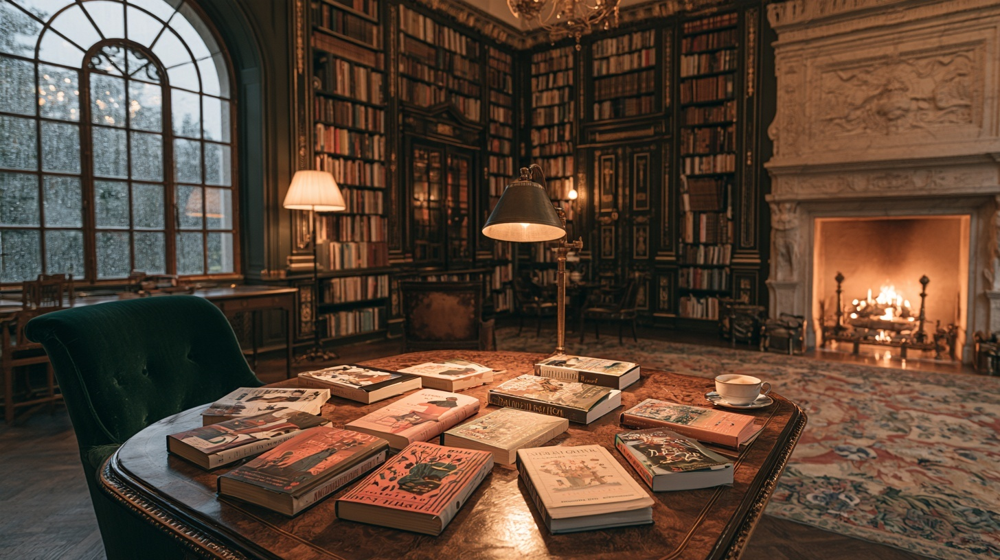

# Assets and local work

`public/` contains the files required to render the current site. Keep source masters, alternative generations, review bundles, and diagnostic output in the top-level `work/` directory. Git ignores `/work/`, and TypeScript excludes it; a clean checkout builds and runs without that directory.

## Runtime files

| Location | Purpose |
| --- | --- |
| `public/brand/*.{svg,png}` | Selected Open Book logo and isolated icon, in parchment and dark walnut; see [brand identity](brand.md) |
| `app/icon.svg`, `app/favicon.ico` | Next.js browser icons; SVG matches `public/brand/icon.svg`, ICO contains 16, 32, and 48 px frames |
| `app/opengraph-image.jpg`, `app/opengraph-image.alt.txt` | 1200 × 630 Open Graph image and descriptive alt text, registered by Next.js |
| `docs/assets/readme-banner.jpg` | 1600 × 600 brand banner used in the root README |
| `public/covers/originals/*.jpg` | Original covers for all 192 library records |
| `public/covers/textures/*.jpg` | The 86 accepted book textures used on the physical table and in material previews |
| `public/rooms/after-hours.jpg` | The selected room background for both active piles |
| `public/audio/background-loop.mp3` | The edited ambient loop |
| `public/audio/book-impacts/*.wav` | The 22 selected table and book contact sounds |
| `public/audio/book-impacts/source.json` | Recording provenance, source timestamps, processing, and checksums |

Original cover URLs and local paths are recorded in `data/library.json` and `data/goodreads-cover-manifest.json`. Cover aspect ratios are in `data/cover-aspects.json`. Keep those references consistent when replacing a file. The physical texture membership is declared in `app/prototypes/reading-room/variants/photo-scene.tsx`; it currently matches the full five-star collection.

The physical textures were promoted from the material study: 69 accepted generated edits and 17 original-cover fallbacks. They retain their existing JPEG bytes and appearance. Large PNG masters and generation-by-generation records are local working assets. Original covers remain available for the library and primary detail artwork.

## Visual provenance

The brand assets preserve the selected Open Book direction from the imagegen logo exploration. The mark and lettering were traced into single-color vector outlines, then exported as transparent PNGs and a compact ICO. The original concept board, tracing script, and review files remain under `work/design/logo-treatments/`; the reusable exports are in `public/brand/` and browser icons are in `app/`.

The social image and README banner were composed with imagegen using the After Hours room and approved Open Book logo as references, adding a small pile of clothbound books. They were resized to their delivery dimensions and compressed as JPEGs. Generation masters and prompts remain under `work/design/social-assets/`.

The chosen After Hours background was generated as an empty, tactile walnut tabletop in a warm mansion library, with a cool rainy window and a distant fireplace. The empty plate lets real book meshes provide the perspective, shadows, and interaction. The [runtime photograph](../public/rooms/after-hours.jpg) is the definitive framing reference.

The [royal salon concept](concepts/royal-salon-2.jpg) preserves one earlier reference for the emerald, walnut, and warm/cool lighting direction. Its baked-in books are concept imagery. It is documentation only.

## Local archive

The cleanup preserved the working files locally in these locations:

- `work/design/`: concept gallery, other concepts, previews, generation records, audio auditions, and detailed profiling output.
- `work/assets/book-texture-masters/`: full-resolution PNG texture sources.
- `work/assets/rooms/`: unused room plates, references, Blender scene, model, and previews.
- `work/scripts/blender/`: the experimental room generator.

Historical Still, Rain, and Spatial components remain in `app/`, outside the active picker. Their alternative room assets are archived locally. Bringing one of those directions back requires deliberately promoting its required assets into `public/` again.

For a new asset, keep only the selected runtime export in `public/`, retain useful provenance in this documentation or a small manifest, and place source files and alternatives in `work/`. Verify all live references after moving files; filename similarity alone does not determine whether an asset is used.
