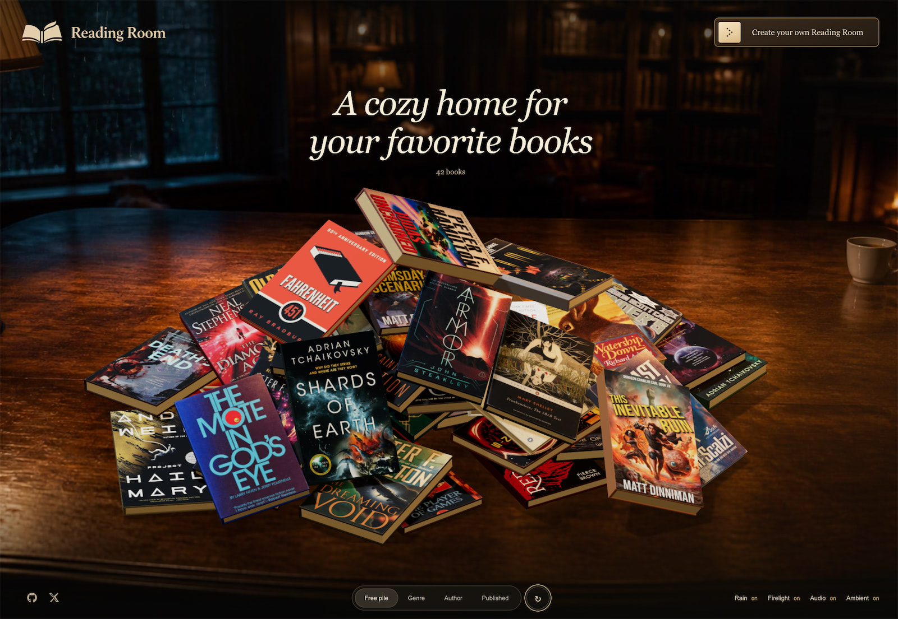
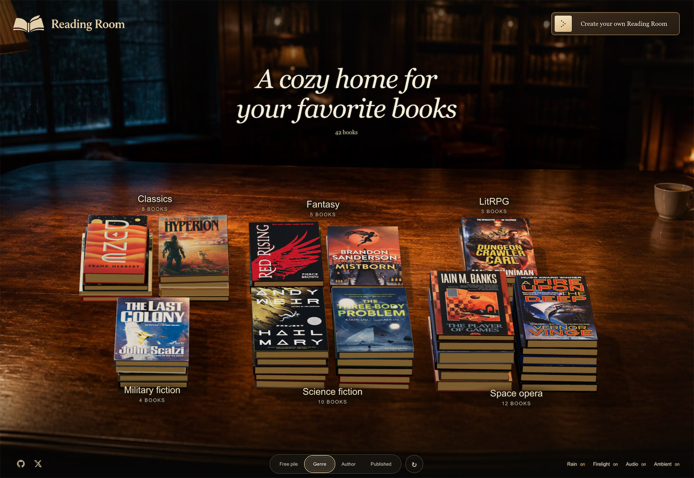

# Reading Room


## Intro

A cozy home for your favorite books

Explore a personal book collection from Goodreads. Move books around, sort them, and open one to learn more.

<p align="center">
  
  
</p>

## Local development

Use Node.js 24 or newer and pnpm. In the project folder, run:

```sh
pnpm install
pnpm dev
```

Open [Reading Room](http://book-library.localhost:1355/).

Run the checks and build the site:

```sh
pnpm test
pnpm build
```

### Main folders

- `app/` — Pages and the reading room.
- `components/` — Shared buttons and other controls.
- `data/` — Book details and the featured book list.
- `lib/` — Shared code for books and the interface.
- `public/` — Images, book covers, and sounds.
- `docs/` — Project notes and design guides.
- `scripts/` — Tools to import books and download covers.
- `tests/` — Checks for book data and room behavior.

## License

[MIT](./license)
